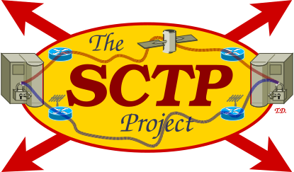

<h1 align="center">
 Dynamic Multi-Homing Setup&nbsp;(DynMHS)<br />
 <span style="font-size: 75%;">A Tool for the Dynamic Setup of Multi-Homing IP Routing Rules</span><br />
 <a href="https://www.nntb.no/~dreibh/tsctp/">
  <br />
  <span style="font-size: 75%;">https://www.nntb.no/~dreibh/tsctp</span>
 </a>
</h1>


# 💡 What is TSCTP?

TSCTP is an SCTP test tool. Its purpose is to perform basic SCTP
functionality tests to check implementations interoperability and
to verify that the SCTP stack is working.


# 😀 Examples

## Preparations

TSCTP uses the SCTP protocol, i.e. sockets with protocol IPPROTO_SCTP. It may be necessary to allow loading the SCTP kernel module first, if not already enabled. The following code blocks show how to enable it permanently.

### SCTP on Linux

```bash
echo "sctp" | sudo tee /etc/modules-load.d/sctp.conf
if [ -e /etc/modprobe.d/sctp-blacklist.conf ] ; then
   sudo sed -e 's/^blacklist sctp/# blacklist sctp/g' -i /etc/modprobe.d/sctp-blacklist.conf
fi
sudo modprobe sctp
lsmod | grep sctp
```

### SCTP on FreeBSD

```bash
echo 'sctp_load="YES"' | sudo tee --append /boot/loader.conf
sudo kldload sctp
kldstat | grep sctp
```

## TSCTP Server Mode

Server mode: bind to all IPv4 and IPv6 addresses, listen on port&nbsp;1234.

```bash
tsctp -L :: -L 0.0.0.0 -p 1234
```

## TSCTP Client Mode

* Client mode:
  bind to all IPv4 and IPv6 addresses,
  connect to localhost (127.0.0.1) on port&nbsp;1234,
  send unlimited number of messages of 4096&nbsp;bytes each,
  stop after 10 s.

  ```bash
  tsctp -L :: -L 0.0.0.0 -n 10 -l 1000 -p 1234 127.0.0.1
  ```

* Client mode:
  bind to all IPv4 and IPv6 addresses,
  connect to localhost (127.0.0.1) on port&nbsp;1234,
  send unlimited number of messages of 4096&nbsp;bytes each,
  stop after 10&nbsp;s.

  ```bash
  tsctp -L :: -L 0.0.0.0 -n 0 -T 10 -l 4096 -p 1234 127.0.0.1
  ```


# 📦 Binary Package Installation

Please use the issue tracker at [https://github.com/dreibh/tsctp/issues](https://github.com/dreibh/tsctp/issues) to report bugs and issues!

## Ubuntu Linux

For ready-to-install Ubuntu Linux packages of TSCTP, see [Launchpad PPA for Thomas Dreibholz](https://launchpad.net/~dreibh/+archive/ubuntu/ppa/+packages?field.name_filter=tsctp&field.status_filter=published&field.series_filter=)!

```bash
sudo apt-add-repository -sy ppa:dreibh/ppa
sudo apt-get update
sudo apt-get install tsctp
```

## Fedora Linux

For ready-to-install Fedora Linux packages of TSCTP, see [COPR PPA for Thomas Dreibholz](https://copr.fedorainfracloud.org/coprs/dreibh/ppa/package/tsctp/)!

```bash
sudo dnf copr enable -y dreibh/ppa
sudo dnf install tsctp
```

## FreeBSD

For ready-to-install FreeBSD packages of TSCTP, it is included in the ports collection, see [FreeBSD ports tree index of net/tsctp/](https://cgit.freebsd.org/ports/tree/net/tsctp/)!

```bash
sudo pkg install tsctp
```

Alternatively, to compile it from the ports sources:

```bash
cd /usr/ports/net/tsctp
make
sudo make install
```


# 💾 Build from Sources

TSCTP is released under the [BSD License](https://opensource.org/license/BSD-3-Clause).

Please use the issue tracker at [https://github.com/dreibh/tsctp/issues](https://github.com/dreibh/tsctp/issues) to report bugs and issues!

## Development Version

The Git repository of the TSCTP sources can be found at [https://github.com/dreibh/tsctp](https://github.com/dreibh/tsctp):

```bash
git clone https://github.com/dreibh/tsctp
cd tsctp
sudo ci/get-dependencies --install
cmake .
make
```

Note: The script [`ci/get-dependencies`](https://github.com/dreibh/tsctp/blob/master/ci/get-dependencies) automatically  installs the build dependencies under Debian/Ubuntu Linux, Fedora Linux, and FreeBSD. For manual handling of the build dependencies, see the packaging configuration in [debian/control](https://github.com/dreibh/tsctp/blob/master/debian/control) (Debian/Ubuntu Linux), [tsctp.spec](https://github.com/dreibh/tsctp/blob/master/rpm/tsctp.spec) (Fedora Linux), and [Makefile](https://github.com/dreibh/tsctp/blob/master/freebsd/tsctp/Makefile) FreeBSD.

Contributions:

* Issue tracker: [https://github.com/dreibh/tsctp/issues](https://github.com/dreibh/tsctp/issues).
  Please submit bug reports, issues, questions, etc. in the issue tracker!

* Pull Requests for TSCTP: [https://github.com/dreibh/tsctp/pulls](https://github.com/dreibh/tsctp/pulls).
  Your contributions to TSCTP are always welcome!

* CI build tests of TSCTP: [https://github.com/dreibh/tsctp/actions](https://github.com/dreibh/tsctp/actions).

* Coverity Scan analysis of TSCTP: [https://scan.coverity.com/projects/dreibh-tsctp](https://scan.coverity.com/projects/dreibh-tsctp).

## Release Versions

See [https://www.nntb.no/~dreibh/tsctp/#current-stable-release](https://www.nntb.no/~dreibh/tsctp/#current-stable-release) for the release packages!


# 🔗 Useful Links

* [NetPerfMeter – A TCP/MPTCP/UDP/SCTP/DCCP Network Performance Meter Tool](https://www.nntb.no/~dreibh/netperfmeter/)
* [HiPerConTracer – High-Performance Connectivity Tracer](https://www.nntb.no/~dreibh/hipercontracer/)
* [SubNetCalc – An IPv4/IPv6 Subnet Calculator](https://www.nntb.no/~dreibh/subnetcalc/)
* [System-Tools – Tools for Basic System Management](https://www.nntb.no/~dreibh/system-tools/)
* [Thomas Dreibholz's SCTP Page](https://www.nntb.no/~dreibh/sctp/)
* [Thomas Dreibholz's Reliable Server Pooling Page](https://www.nntb.no/~dreibh/rserpool/)
* [NorNet – A Real-World, Large-Scale Multi-Homing Testbed](https://www.nntb.no/)
* [NEAT – A New, Evolutive API and Transport-Layer Architecture for the Internet](https://neat.nntb.no/)
* [Michael Tüxen's SCTP Page](https://www.sctp.de/)
* [Lode Coene's SCTP Page](https://web.archive.org/web/20210813064400/http://www.sctp.be/)
* [OpenSS7](https://web.archive.org/web/20210813195936/http://www.openss7.org/)
* [Wireshark](https://www.wireshark.org/)
